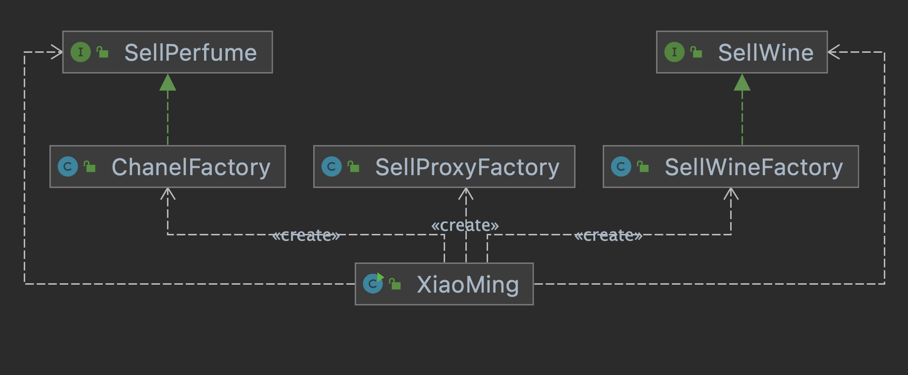
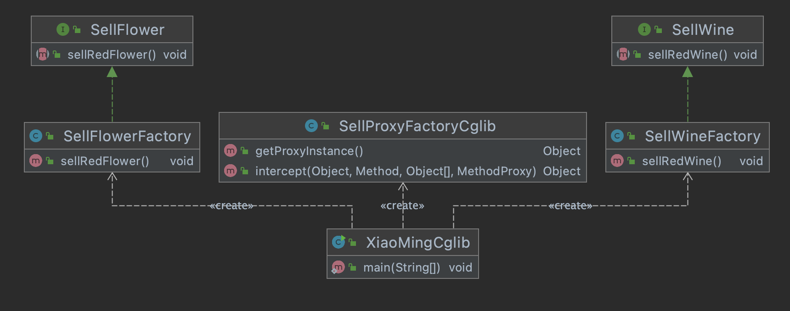

# 动态代理设计模式

这篇文章的思路还是同之前的文章一样，由浅入深，如果你已经看过上一篇文章，部分章节可以跳过。

## 静态代理

那么，到底什么是代理呢？

> 所谓的代理，其实就是中间人的意思。例如：小明想购买法国某个牌子的香水送给女朋友，但是在国内没有货源售卖，亲自去法国又大费周章了，而小红现在正在法国玩耍，她和小明是好朋友，可以帮小明买到这个牌子的香水，于是小明就找到小红，答应给她多加 5% 的辛苦费，小红答应了，小明成功在中国买到了法国的香水。之后小红开启了疯狂的代购模式，赚到了很多手续费。

**角色：**

- 代理小红

- 被代理类是售卖厂商

- 客户小明

理解了代理的意思，接下来我们一起来看一下，在面向对象编程语言中，到底应该如何体现代理呢。

这里我们就以上面提到的代购为例，来写一个简单的代理实现。

我们用`XiaoHongSellProxy`类表示小红，用`ChanelFactory`表示售卖厂商，用`XiaoMingClient`表示小明，上面的例子用代码实现应该是这样：

为了统一代理和被代理方法统一，提取一个接口：

```java
public interface SellPerfume {
    //卖香水
    void sellPerfume(double price);
}
```

```java
public class XiaoHongSellProxy implements SellPerfume{
    private SellPerfume sellPerfumeFactory;
    public XiaoHongSellProxy(SellPerfume sellPerfumeFactory) {
        this.sellPerfumeFactory = sellPerfumeFactory;
    }
    @Override
    public void sellPerfume(double price) {
        doSomethingBeforeSell(); // 前置增强
        sellPerfumeFactory.sellPerfume(price);
        doSomethingAfterSell(); // 后置增强
    }
    private void doSomethingBeforeSell() {
        System.out.println("小红代理购买香水前的额外操作...");
    }
    private void doSomethingAfterSell() {
        System.out.println("小红代理购买香水后的额外操作...");
    }
}
public class ChanelFactory implements SellPerfume{
    @Override
    public void sellPerfume(double price) {
        System.out.println("成功购买香奈儿品牌的香水，价格是：" + price + "元");
    }
}

public class XiaoMingClient {
    public static void main(String[] args) {
        ChanelFactory factory = new ChanelFactory();
        //购买商品找小红代理
        XiaoHongSellProxy proxy = new XiaoHongSellProxy(factory);
        proxy.sellPerfume(1999.99);
    }
}

```


在上面这段代码中，我们实现了一个简单的代理。这里的代理类是`XiaoHongSellProxy`，被代理类是`ChanelFactory`，通过这段代码，我们知道了一个基本事实：**代理对象**是真正去执行动作的对象，**被代理对象**是被动执行动作的对象。

我们已经完成了一个标准的静态代理实现。**之所以称之为静态代理，是因为这里的逻辑是写死的，在编译期间就已经把代理类和目标类确定下来了，并不具备动态特性**。

**静态代理**

- 优点：代码结构简单，较容易实现
- 缺点：无法适配所有代理场景，如果有新的需求，需要修改代理类，**不符合软件工程的开闭原则**

小红现在只是代理香水，如果小明需要找小红买法国红酒，那小红就需要代理法国红酒了，但是静态代理去扩展代理功能**必须修改小红内部的逻辑，这会让小红内部代码越来越臃肿**。

如果要代理购买红酒，该怎么做呢？

- 创建售卖红酒的接口
- 售卖红酒提供商和代理对象小红都需要实现该接口
- 小何访问小红，让小红卖给他红酒

如果以后还要代理其他的还需要对代码需要改动。


## 动态代理

### JDK动态代理

JDK Proxy 是 JDK 提供的一个动态代理机制，它涉及到两个核心类，分别是`Proxy`和`InvocationHandler`，我们先来了解如何使用它们。

以小红代理卖香水的故事为例，小明要购买红酒，建立`卖红酒厂商(SellWineFactory)`，统一的`酒售卖接口(SellWine)`。重点是**小红代理**，这里的代理对象不再是小红一个人，而是一个`代理工厂(SellProxyFactory)`，里面会有许多的代理对象。


```java
public class SellProxyFactory implements InvocationHandler {
    /** 代理的真实对象 */
    private Object realObject;

    public SellProxyFactory(Object realObject) {
        this.realObject = realObject;
    }

    /**
     *
     * @param proxy 代理对象
     * @param method 真正执行的方法
     * @param args 执行方法的入参
     * @return
     * @throws Throwable
     */
    @Override
    public Object invoke(Object proxy, Method method, Object[] args) throws Throwable {
        doSomethingBefore();
        Object obj = method.invoke(realObject, args);
        doSomethingAfter();
        return obj;
    }

    private void doSomethingAfter() {
        System.out.println("执行代理后的额外操作...");
    }

    private void doSomethingBefore() {
        System.out.println("执行代理前的额外操作...");
    }

}


public interface SellWine {
    void sellRedWine();
}
public class SellWineFactory implements SellWine{
    @Override
    public void sellRedWine() {
        System.out.println("成功购买红酒，价格是：5000 元");
    }
}

public class XiaoMing {
    public static void main(String[] args) {

        //卖香水的厂商
        ChanelFactory chanelFactory = new ChanelFactory();
        //卖红酒的厂商
        SellWineFactory sellWineFactory = new SellWineFactory();

        SellWine sellWine = (SellWine) Proxy.newProxyInstance(sellWineFactory.getClass().getClassLoader(), sellWineFactory.getClass().getInterfaces(), new SellProxyFactory(sellWineFactory));
        sellWine.sellRedWine();

        /**
         * ClassLoader loader：加载动态代理类的类加载器，被代理类的类加载器
         * Class<?>[] interfaces：代理类实现的接口，可以传入多个接口，被代理类的实现的接口
         * InvocationHandler h：指定代理类的调用处理程序，即调用接口中的方法时，会找到该代理工厂h，执行invoke()方法
         * Proxy.newProxyInstance(ClassLoader loader, Class<?>[] interfaces, InvocationHandler h);
         */
        SellPerfume sellPerfume = (SellPerfume) Proxy.newProxyInstance(chanelFactory.getClass().getClassLoader(),
                chanelFactory.getClass().getInterfaces(),
                new SellProxyFactory(chanelFactory));
        sellPerfume.sellPerfume(1999.99);
    }
}
```



### CGLIB动态代理

CGLIB（Code generation Library） 不是 JDK 自带的动态代理，它需要导入第三方依赖，它是一个字节码生成类库，能够在运行时动态生成代理类对 **Java类 和 Java接口** 扩展。

代理类

```java
public class SellProxyFactoryCglib implements MethodInterceptor {
    private static SellProxyFactoryCglib instance = new SellProxyFactoryCglib();
    private SellProxyFactoryCglib(){
    }
    public static SellProxyFactoryCglib getInstance(){
        return instance;
    }
    @SuppressWarnings("unchecked")
    public <T> T getProxy(Class<T> cls){
        return (T) Enhancer.create(cls, this);
    }
    //实现MethodInterceptor接口生成方法拦截器
    @Override
    public Object intercept(Object o, Method method, Object[] objects, MethodProxy methodProxy) throws Throwable {
        System.out.println("Before: "  + method.getName());
        Object obj = methodProxy.invokeSuper(o, objects);
        System.out.println("After: " + method.getName());
        return obj;
    }
}

public interface SellFlower {

    void sellRedFlower();
}
public class SellFlowerFactory implements SellFlower{
    @Override
    public void sellRedFlower() {
        System.out.println("售卖红花 1000 元");
    }
}
public class XiaoMingCglib {

    public static void main(String[] args) {

        SellFlowerFactory sellFlowerFactory = SellProxyFactoryCglib.getInstance().getProxy(SellFlowerFactory.class);
        sellFlowerFactory.sellRedFlower();

        SellWineFactory sellWineFactory = SellProxyFactoryCglib.getInstance().getProxy(SellWineFactory.class);
        sellWineFactory.sellRedWine();
    }
}
```




### 两者区别

> **Cglib和jdk动态代理的区别？**

1、Jdk动态代理：利用拦截器（必须实现InvocationHandler）加上反射机制生成一个代理接口的匿名类，在调用具体方法前调用InvokeHandler来处理

2、 Cglib动态代理：利用ASM框架，对代理对象类生成的class文件加载进来，通过修改其字节码生成子类来处理（使用字节码处理框架ASM，来转换字节码并生成新的类。 ）

> **什么时候用cglib什么时候用jdk动态代理？**

1、目标对象生成了接口 默认用JDK动态代理

2、如果目标对象使用了接口，可以强制使用cglib

3、如果目标对象没有实现接口，必须采用cglib库，Spring会自动在JDK动态代理和cglib之间转换

> **JDK动态代理和cglib字节码生成的区别？**

1、JDK动态代理只能对实现了接口的类生成代理，而不能针对类

2、Cglib是针对类实现代理，主要是对指定的类生成一个子类，覆盖其中的方法，并覆盖其中方法的增强，但是因为采用的是继承，所以该类或方法最好不要生成final，对于final类或方法，是无法继承的

>  **Cglib比JDK快？**

1、cglib底层是ASM字节码生成框架，但是字节码技术生成代理类，在JDL1.6之前比使用java反射的效率要高

2、在jdk6之后逐步对JDK动态代理进行了优化，在调用次数比较少时效率高于cglib代理效率

3、只有在大量调用的时候cglib的效率高，但是在1.8的时候JDK的效率已高于cglib

4、Cglib不能对声明final的方法进行代理，因为cglib是动态生成代理对象，final关键字修饰的类不可变只能被引用不能被修改

> **Spring如何选择是用JDK还是cglib？**

1、当bean实现接口时，会用JDK代理模式

2、当bean没有实现接口，用cglib实现

3、可以强制使用cglib（在spring配置中加入<aop:aspectj-autoproxy proxyt-target-class=”true”/>）

|                  | Cglib                                                        | JDK                                                          |
| ---------------- | ------------------------------------------------------------ | ------------------------------------------------------------ |
| 是否提供子类代理 | 是                                                           | 否                                                           |
| 是否提供接口代理 | 是（可强制）                                                 | 是                                                           |
| 区别             | 必须依赖于CGLib的类库，但是它需要类来实现任何接口代理的是指定的类生成一个子类，覆盖其中的方法 | 实现InvocationHandler 使用Proxy.newProxyInstance产生代理对象 被代理的对象必须要实现接口 |

## 使用场景

### Spring AOP动态代理


### Mybatis Mapper动态代理

