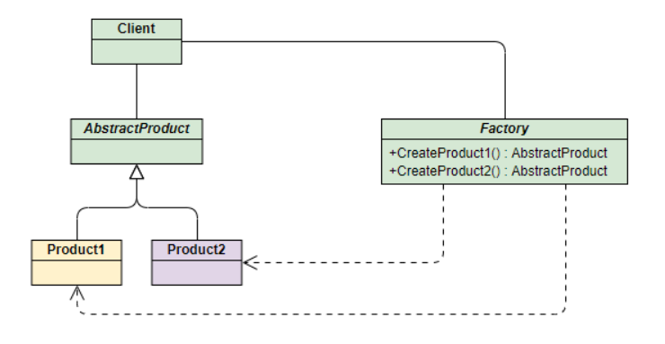
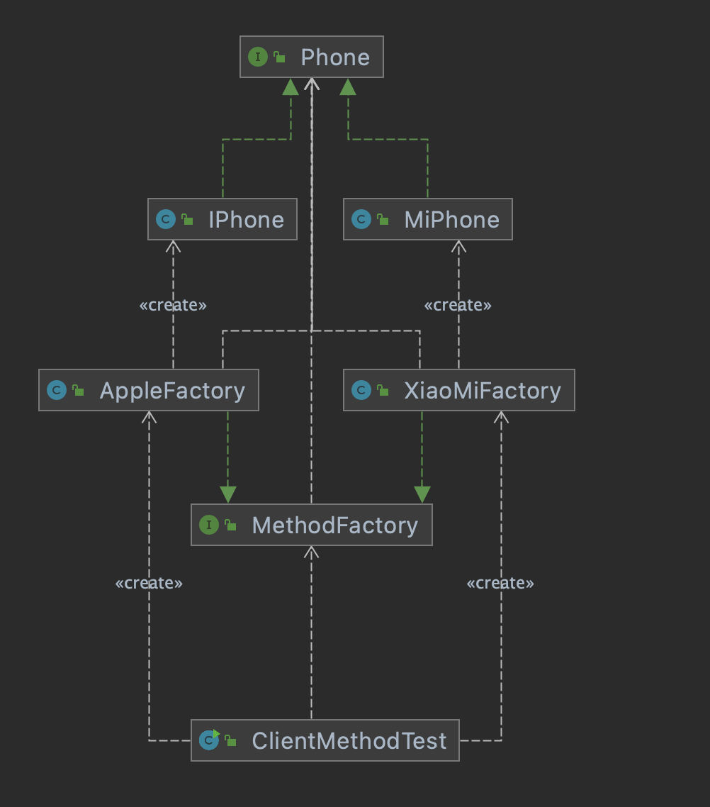

# 一、工厂模式

优秀文章：

- https://blog.csdn.net/m0_37965018/article/details/103152585
- https://blog.csdn.net/qq_33732195/article/details/110101808


工厂顾名思义就是创建产品，根据产品是具体产品还是具体工厂可分为简单工厂模式和工厂方法模式，根据工厂的抽象程度可分为工厂方法模式和抽象工厂模式。**该模式用于封装和管理对象的创建**，是一种创建型模式。本文从一个具体的例子逐步深入分析，来体会三种工厂模式的应用场景和利弊。

## 1.1 简单工厂模式

该模式对对象创建管理方式最为简单，因为其仅仅简单的对不同类对象的创建进行了一层薄薄的封装。该模式通过向工厂传递类型来指定要创建的对象。



使用手机生产来讲解该模式：

**Phone类**：手机标准规范类(AbstractProduct)

```java
public interface Phone {
    void make();
}
```

**MiPhone类**：制造小米手机（Product1）

```java
public class MiPhone implements Phone{
    public MiPhone(){
        this.make();
    }
    @Override
    public void make() {
        System.out.println("制作小米手机");
    }
}

```

**IPhone类**：制造苹果手机（Product2）

```java
public class IPhone implements Phone{
    public IPhone() {
        this.make();
    }
    @Override
    public void make() {
        System.out.println("制作苹果手机");
    }
}
```

**PhoneFactory类**：手机代工厂（Factory）

```java
public class PhoneFactory {
    /**
     *
     * @param phoneType
     * @return
     */
    public Phone makePhone(String phoneType){
        if(phoneType.equalsIgnoreCase("MiPhone")){
            return new MiPhone();
        }else if (phoneType.equalsIgnoreCase("IPhone")){
            return new IPhone();
        }
        return null;
    }
}

```

测试：

```java
public static void main(String[] arg){
        PhoneFactory phoneFactory = new PhoneFactory();
        MiPhone miphone = (MiPhone) phoneFactory.makePhone("Miphone");
        IPhone iPone = (IPhone) phoneFactory.makePhone("IPhone");
}
```

如果以后再加一些品牌的手机制造，就需要改手机工厂的代码，违反了开闭原则。


## 1.2 工厂方法模式

和简单的工厂模式中工厂负责生产的所有相比，工厂方法模式将生成具体产品的任务分发给具体的产品工厂。


也就是定义一个抽象工厂，其定义了产品的生产接口，但不负责具体的产品，将生产任务交给不同的派生类工厂。这样不用通过指定类型来创建对象了。



接下来继续使用生产手机的例子来讲解该模式。

其中和产品相关的Phone类、MiPhone类和IPhone类的定义不变。

**MethodFactory类**：生产不同产品的工厂的抽象类

```java
public interface MethodFactory {
    Phone makePhone();
}
```

**XiaoMiFactory类**：生产小米手机的工厂（ConcreteFactory1）

```java
public class XiaoMiPhoneFactory implements MethodFactory {
    @Override
    public Phone makePhone() {
        return new MiPhone();
    }
}
```

**AppleFactory类**：生产苹果手机的工厂（ConcreteFactory2）

```java
public class ApplePhoneFactory implements MethodFactory{
    @Override
    public Phone makePhone() {
        return new IPhone();
    }
}
```

**测试**：

```java
public class demo {
    public static void main(String[] args) {
        MethodPhoneFactory xiaoMiFactory = new XiaoMiPhoneFactory();
        MethodPhoneFactory appleFactory = new ApplePhoneFactory();
        xiaoMiFactory.makePhone();
        appleFactory.makePhone();
    }
}
```

如果需要制作新的品牌手机，就创建一个新的品牌手机工厂继承AbstractFactory接口，不需要改源代码。

每增加一个具体的产品就需要创建一个具体的工厂，增加了系统的复杂度。


## 1.3抽象工厂模式

上面两种模式不管工厂怎么拆分抽象，都只是针对一类产品**Phone**（AbstractProduct），如果要生成另一种产品PC，那么就得使用抽象工厂模式。

抽象工厂模式通过在AbstarctFactory中增加创建产品的接口，并在具体子工厂中实现新加产品的创建，当然前提是子工厂支持生产该产品。否则继承的这个接口可以什么也不干。


从上面类图结构中可以清楚的看到如何在工厂方法模式中通过增加新产品接口来实现产品的增加的。

接下来我们继续通过小米和苹果产品生产的例子来解释该模式。

**PC接口**：定义PC产品的接口(AbstractPC)

```java
public interface PC {
    void make();
}
```

**MiPC类**：定义小米电脑产品(MIPC)

```java
public class MiPC implements PC{

    public MiPC(){
        this.make();
    }
    @Override
    public void make() {
        System.out.println("制作小米电脑");
    }
}
```

**MAC类**：定义苹果电脑产品(MAC)

```java
public class MAC implements PC{
    public MAC(){
        this.make();
    }
    @Override
    public void make() {
        System.out.println("制作苹果电脑");
    }
}
```

下面需要修改工厂相关的类的定义：

**AbstractFactory类**：增加PC产品制造接口

```java
public interface AbstractFactory {
    Phone makePhone();

    PC makePC();
}
```

**XiaoMiFactory类**：增加小米PC的制造（ConcreteFactory1）

```java
public class AppleFactory implements AbstractFactory{
    @Override
    public Phone makePhone() {
        return new IPhone();
    }

    @Override
    public PC makePC() {
        return new MAC();
    }
}
```

**AppleFactory类**：增加苹果PC的制造（ConcreteFactory2）

```java
public class XiaoMiFactory implements AbstractFactory {
    @Override
    public Phone makePhone() {
        return new MiPhone();
    }

    @Override
    public PC makePC() {
        return new MiPC();
    }
}
```

**演示：**

```java
public static void main(String[] args) {
    AbstractFactory xiaoMiFactory = new XiaoMiFactory();
    AbstractFactory appleFactory = new AppleFactory();
    xiaoMiFactory.makePhone();
    appleFactory.makePhone();
    xiaoMiFactory.makePC();
    appleFactory.makePC();
}
```

弊端：如果再想要生产耳机，就需要改源代码。


工厂方法和抽象工厂都有一些缺点。

有没有记不需要创建大量的工厂，也不需要修改源代码的工厂呢？

spring中bean工厂就很好的做到了这一点。


## 应用场景

> - JDK中Calendar的getlnstance方法
> - JDBC中的Connection对象的获取
> - Spring中IOC容器创建管理bean对象
> - 反射中Class对象的newlnstance方法


### Spring中bean工厂


## 总结：

名词用抽象类，形容词用接口。

**优点：**克服了简单工厂违背开放-封闭原则的缺点，又保留了封装对象创建过程的优点,降低客户端和工厂的耦合性，所以说“工厂模式”是“简单工厂模式”的进一步抽象和推广。封装了大量对象和工厂创建，新加产品需要修改已定义好的工厂相关的类，因此对于产品和工厂的扩展不太友好，利弊需要权衡一下。 

**缺点：**每增加一个产品，就要创建一个子工厂，增加了开发量。

