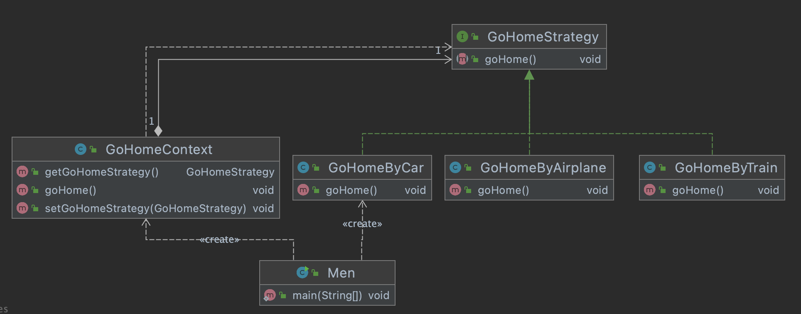

## 策略模式

在魂斗罗小游戏中，我们发射子弹，就是使用的策略模式。扣动扳机的目的就是发出子弹，根据你的攻击力可以发射不同的子弹。可以一次3发子弹，一次6发子弹，发火球，发手雷...

都是根据相同的方法可以发出不同的子弹。


- 策略模式共分为三种角色：
  - Context（上下文环境）：持有抽象策略类，调用策略方法。
  - Strategy（抽象策略类）：声明策略方法。
  - Concrete Strategy（具体策略类）：实现策略方法。
- Context持有State的引用，完成对ConcreteStrategy中策略方法的调用

写一个例子

快过年了，都想着回老家。可以坐飞机，火车，高铁，班车，开车....


首先定一个抽象策略接口，抽象回家的策略接口`GoHomeStrategy`

```java
public interface GoHomeStrategy {

    /**
     * 回家
     */
    public void goHome();
}
```

声明策略

具体策略1：开车

```java
public class GoHomeByCar implements GoHomeStrategy{

    @Override
    public void goHome() {
        System.out.println("开车回家。。。。");
    }
}
```

具体策略2：坐火车

```java
public class GoHomeByTrain implements GoHomeStrategy{

    @Override
    public void goHome() {
        System.out.println("坐火车回家。。。。");
    }

}
```

具体策略3：坐飞机

```java
public class GoHomeByAirplane implements GoHomeStrategy{

    @Override
    public void goHome() {
        System.out.println("坐飞机回家。。。。");
    }
}
```

声明一个调用策略的上下文环境类`GoHomeContext`

```java
public class GoHomeContext {

    private GoHomeStrategy goHomeStrategy;

    public GoHomeStrategy getGoHomeStrategy() {
        return goHomeStrategy;
    }

    public void setGoHomeStrategy(GoHomeStrategy goHomeStrategy) {
        this.goHomeStrategy = goHomeStrategy;
    }

    public void goHome(){
        goHomeStrategy.goHome();
    }
}
```

打工人回家选择

```java
public class Men {

    public static void main(String[] args) {
        GoHomeContext goHomeContext = new GoHomeContext();
        //1.开车
        goHomeContext.setGoHomeStrategy(new GoHomeByCar());
        goHomeContext.goHome();
        //2.坐火车
        goHomeContext.setGoHomeStrategy(new GoHomeByTrain());
        goHomeContext.goHome();
        //3.坐飞机
        goHomeContext.setGoHomeStrategy(new GoHomeByAirplane());
        goHomeContext.goHome();
    }
}
```




## 使用场景

### JDK源码解析Comparator排序

Comparator抽象的策略接口

```java
public interface Comparator<T> {
    int compare(T o1, T o2);
```

策略1`Arrays`数组排序工具类


```java
//数组排序
public class Arrays {
		public static <T> void sort(T[] a, Comparator<? super T> c) {
        if (c == null) {
            sort(a);
        } else {
            if (LegacyMergeSort.userRequested)
                legacyMergeSort(a, c);
            else
                TimSort.sort(a, 0, a.length, c, null, 0, 0);
        }
    }
}


public static void main(String[] args) {
  	//测试，使用策略模式，根据不同的数组，使用不同的策略
		Arrays.sort(new Integer[]{2,3,42,2}, (o1, o2) -> o2 - o1);
}


```


